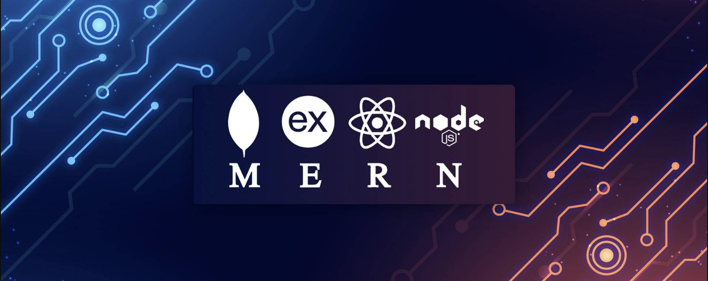

<!-- ===================== BANNER IMAGE ===================== -->

  <!-- Replace the src with your uploaded banner image path -->
  

<!-- ===================== NAME & ROLE ===================== -->
<h1 align="center">Hi 👋, I'm Jobayer Hossen</h1>
<h3 align="center">MERN Stack Developer</h3>

<!-- ===================== PROFILE VIEWS ===================== -->

  

---

## 👨‍💻 About Me

I am a passionate MERN Stack developer focused on building scalable and user-friendly web applications.  
I enjoy working with modern JavaScript technologies and turning ideas into real-world products.  
Currently, I am improving my full-stack skills and building production-ready projects.

---

## 🚀 Current Activities

- 🌱 Exploring **Next.js** and advanced React patterns
- 🔧 Building REST APIs with **Node.js & Express**
- 📚 Learning best practices for performance and clean architecture

---

## 🛠️ Skills

### 🎨 Frontend

  

### ⚙️ Backend

  

### 🧰 Tools & Platforms

  

---

## 🌐 Connect With Me

  
  
  

---

## 📊 GitHub Stats

<!-- Contribution Stats -->
<h2 align="center">📊 GitHub Contribution</h2>

  

<h2 align="center">📊 GitHub Activity</h2>

  

<!-- Top Languages -->
<h2 align="center">🧠 Top Languages</h2>

  

---

⭐️ _Thanks for visiting my profile! Feel free to explore my repositories and connect with me._
